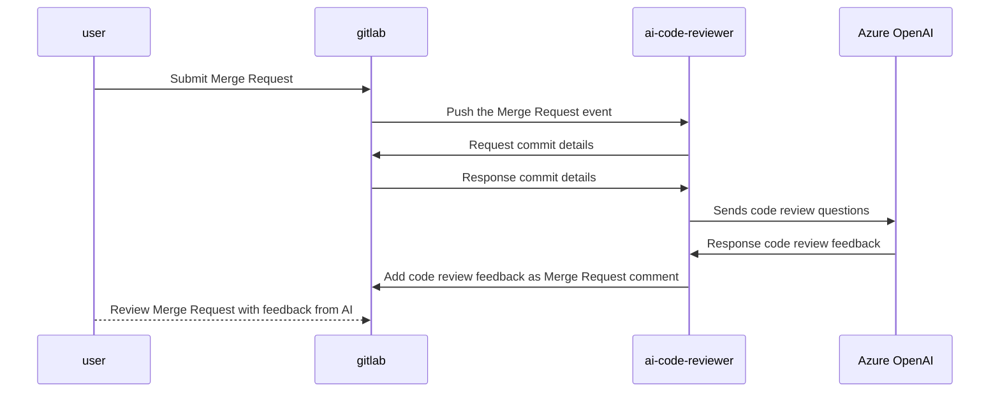

# ai-merge-request-reviewer

## flow



## to setup
```powershell
# clone the project
git clone https://gitlab.macquarietelecom.com/lhao/ai-code-reviewer.git

cd ai-code-reviewer

# put environment variables
touch .env

# setup venv
python -m venv .venv
# activate venv on windows
.\.venv\Scripts\activate
# check if venv works
where.exe pip
# install dependencies
pip install -r requirements.txt
# to deactivate
deactivate

# alternatively, setup via pipenv
python -m pip install pipenv  # only if pipenv not installed yet
# init venv
pipenv shell
# install dependencies
pipenv install
```

## to run the web listener
```sh
# to run the app
.\.venv\Scripts\python.exe -m src.ai_code_reviewer.app
```

## .env
```
# example format of .env
OPENAI_API_KEY=<OPENAI_API_KEY>
OPENAI_API_BASE=<AZURE_API_BASE_URL>
OPENAI_API_VERSION=<AZURE_OPENAI_VERSION>

GITLAB_TOKEN=<GITLAB_ACCESS_TOKEN>
GITLAB_URL=<GITLAB_URL>/api/v4

WEBHOOK_TOKEN=<GITLAB_WEBHOOK_TOKEN>
WEBHOOK_PORT=<WEBHOOK_PORT>
```
