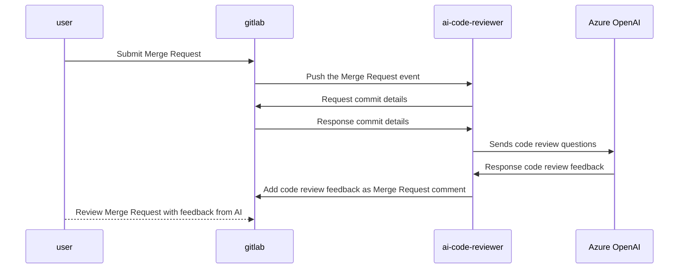

# ai-merge-request-reviewer

## flow




## .env
```
# example format of .env
PYTHONPATH=src

PIPENV_VENV_IN_PROJECT=1

# gitlab conf
GITLAB_URL=<gitlab_url>
GITLAB_TOKEN=<gitlab_token>

WEBHOOK_TOKEN=<gitlab_webhook_token>
WEBHOOK_PORT=<gitlab_webhook_port>


# Azure OpenAI credentials
AZURE_OPENAI_ENDPOINT=https://openaimtg.openai.azure.com/
AZURE_OPENAI_KEY=<openai_api_key>
```
